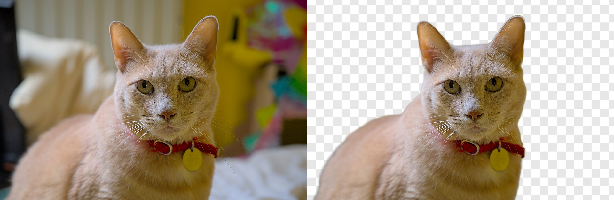

# weBG

weBG is a browser-side, one-click background remover for JPEG, PNG, and WebP images. This **desktop beta** is intended for an image editor where a user chooses one photo and clicks **Remove background**. The library returns a transparent PNG `Blob` or an explicit error.

The supported photo has one visually dominant person, animal, vehicle, boat, flower, or discrete object. Automatic selection of a detached ball, skateboard, second subject, or whole landscape is outside this beta's promise. Mobile browsers and manual refinement are not qualified for this release.



Truthfully this was created for my own personal use in another project... so it is limited/tailored to my needs.

The release assets are publicly downloadable, but weBG's original code remains `UNLICENSED`. The third-party runtime and models retain their separate licenses below.

## Use it

Download the [versioned browser bundle](https://github.com/gregorycotton/weBG/releases/download/v0.1.0-beta.2/webg-0.1.0-beta.2-browser.tar.gz) and unpack it into your site's static root. It contains the library and both tested ONNX files. Serve the extracted `webg/` and `models/` directories on the **same origin** as the page. The example below imports the hosted copy of `index.js`; it does not use a bundler's bare `webg` import. The paths are:

```text
/webg/dist/index.js
/webg/dist/worker.js
/webg/dist/ort-wasm-simd-threaded.mjs
/webg/dist/ort-wasm-simd-threaded.wasm
/models/birefnet-lite-512.json
/models/birefnet-lite-512.onnx
/models/yolos-tiny-416.json
/models/yolos-tiny-416.onnx
```

Keep `worker.js` and the WASM files adjacent to `index.js`. Deploy the library build, manifests, and ONNX files as one versioned set so a cached worker or manifest cannot be mixed with another model version.

For npm consumers, the same release also provides [`webg-0.1.0-beta.2.tgz`](https://github.com/gregorycotton/weBG/releases/download/v0.1.0-beta.2/webg-0.1.0-beta.2.tgz). It contains `dist/` and the manifests; host the ONNX files from the browser bundle alongside it. Installing the GitHub source repository directly is not supported because built files and ONNX assets are Git-ignored.

**Model provenance:** The browser bundle includes the exact tested binaries. Their SHA-256 values are BiRefNet_lite 512 `eba7f32d81b4ea697334d467f44d373094633f3dd02eeb000e5f592510f79164` and YOLOS-Tiny `b12c56df09c905ae7ace9944b7981a88a20e2b9a006f1b052861b05c6e4362c1`. A source checkout can reproduce and verify them with the pinned export process:

```sh
python3.11 -m venv .venv
.venv/bin/pip install -r scripts/requirements-export.txt
.venv/bin/python scripts/export_birefnet_lite.py
.venv/bin/python -c 'from huggingface_hub import snapshot_download; snapshot_download(repo_id="hustvl/yolos-tiny", revision="1a00cc14a139ff40bac9aa00c745915cb7b5b751", allow_patterns=["model.safetensors", "config.json", "preprocessor_config.json"], local_dir=".venv/yolos-tiny-source")'
.venv/bin/python scripts/export_yolos_tiny.py .venv/yolos-tiny-source models/yolos-tiny-416.onnx
npm run verify:model
```

Re-exporting can produce different bytes in another Python environment; do not substitute a model that fails the hash check. The export loads pinned upstream Python model code; review it before running the commands. See `DEVELOPMENT.md` in the source checkout for more detail.

```js
import { createSegmenter } from "/webg/dist/index.js";

const manifest = await fetch("/models/birefnet-lite-512.json").then(response => response.json());
const segmenter = createSegmenter({ model: manifest.runtime });

try {
  const transparentPng = await segmenter.removeBackground(imageBlob);
  // Use transparentPng in the editor.
} finally {
  segmenter.dispose();
}
```

Keep a segmenter alive across multiple images to reuse its loaded model session. Only one operation may run on that instance at a time. `removeBackground()` runs 512 inference and PNG export; the lower-level `segment()` and `exportCutout()` methods remain available when the editor needs a model-resolution soft mask. `initialize()` preloads the model. `dispose()` releases the worker.

## Limits and output

| Setting | Default |
| --- | ---: |
| Compressed input | 25 MiB |
| Decoded source | 40 million pixels |
| One-click PNG output | Up to 16 million pixels |

The one-click method scales a larger source down to the output cap while preserving its aspect ratio. Pass `{ maxOutputPixels: 8_000_000 }` as the third argument to `removeBackground()` for a smaller PNG. `createSegmenter()` accepts `maxInputBytes`, `maxInputPixels`, and `maxExportPixels` if the host needs tighter limits. Image dimensions are checked before full decoding; invalid, truncated, and over-limit inputs reject with an error. An image with no detected subject rejects instead of yielding a silently blank PNG.

The mask is one byte per pixel at the model's **512 × 512 resolution**, with explicit mapping to the source dimensions. Normal editing can use the source and mask separately. PNG export performs the larger RGBA allocation only when requested. Upscaling a mask cannot recover detail that the model did not infer.

## Beta evidence and limitations

The frozen desktop qualification scored **81/90 usable automatic cutouts**, exactly meeting the predeclared overall and per-category gates. One image returned an explicit no-subject error; other misses included missing thin parts, an incorrect foreground selection, and retained background. This selected photo set does not estimate success across arbitrary uploads. Chrome and Safari each completed a separate 20-photo repeated-use run without a reload: 19 valid PNGs and one explicit no-subject result.

The source checkout keeps the quality decision in `BETA_RELEASE.md`, the full text-only per-image record in `QUALIFICATION.md`, timing measurements in `PERFORMANCE.md`, and development instructions in `DEVELOPMENT.md`. Development photo sets, output PNGs, and local release binaries are Git-ignored; tests and research notes are excluded from the npm tarball.

## Attribution

This beta uses ONNX Runtime Web (MIT), BiRefNet_lite model weights (MIT), and YOLOS-Tiny model weights (Apache 2.0). The applicable copyright and license text is in [LICENSES.md](LICENSES.md).
